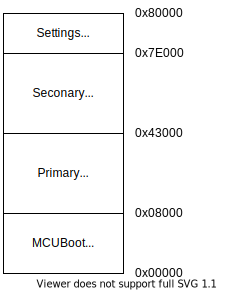

.. _find_my_uarp:

Find My firmware update with UARP
#################################

This document describes how to prepare the Find My compatible accessory to perform firmware updates using the UARP protocol.

UARP update procedure
*********************

This is what happens during the UARP update procedure:

1. An application with the UARP support enabled generates a signed MCUBoot image during the build.
#. Add the image into a SuperBinary file which is in a file format defined by the UARP specification.
#. The SuperBinary file goes to a manufacturer HTTP server together with the associated release notes.
#. Information about a new update goes to an Apple server.
#. An iOS device gets the update information for an accessory paired with it and shows it to the user.
#. The user starts a firmware update process.
#. The iOS device offers the SuperBinary to the accessory.
#. The accessory accepts it and downloads it.
#. The new application image is extracted from the SuperBinary to a flash partition reserved for the new images.
#. When the image is transferred successfully, it is marked as ready and the accessory restarts.
#. The MCUBoot firmware starts at the beginning and checks if the new image is valid.
#. The MCUBoot swaps the new and old images and starts the application from the new image.
#. The application confirms that it runs correctly and the new image becomes the current image.
#. If the application fails to confirm or there is some other failure before that,
   the MCUBoot swaps the images back and the previous application is restored.

Enabling UARP for application
*****************************

The :kconfig:option:`CONFIG_FMNA_CAPABILITY_FW_UPDATE_ENABLED` Kconfig option enables firmware update capability for Find My.
As a result, the :kconfig:option:`CONFIG_FMNA_UARP` Kconfig option will be available and enabled by default.
It performs the following tasks necessary for the updates over the UARP using the MCUBoot bootloader:

* Divides flash into partitions required by the MCUBoot.
* Places the application into the right partition.
* Adds the MCUBoot bootloader application as a child image,
  so it is always built when the application is built and
  it is always programmed when the application is programmed with the ``west`` tool.
* Adds sources implementing the UARP protocol.
* Adds sources for writing a new MCUBoot image to the flash and passing it to the MCUBoot bootloader.

For more details about the bootloader and firmware updates, see the
`nRF Connect SDK documentation <https://docs.nordicsemi.com/bundle/ncs-latest/page/nrf/config_and_build.html>`_.

Signing the MCUBoot images is mandatory.
For development purposes, you can use the example keys distributed with MCUboot.
These keys are not secure and cannot be used in production.
You have to generate your own production key pair.
For more details, see `Signature keys <https://docs.nordicsemi.com/bundle/ncs-latest/page/nrf/config_and_build/bootloaders/bootloader_signature_keys.html>`_
in the MCUboot documentation.

To learn how to handle the keys, see the :ref:`locator_tag`.
Find My samples and applications from this repository use default (insecure) MCUboot keys that are intended for demonstration purposes.
Do not use these keys for production.

To configure the production key file in your Find My application, complete the following steps:

1. Create an MCUboot key file yourself using the ``Image tool`` as follows:

   .. code-block:: console

      python <ncs_path>/bootloader/mcuboot/scripts/imgtool.py keygen -k mcuboot_private.pem -t rsa-2048

#. Set the :kconfig:option:`CONFIG_BOOT_SIGNATURE_KEY_FILE` Kconfig option to :file:`mcuboot_private.pem` in your MCUboot child image configuration file.
#. Place the :file:`mcuboot_private.pem` file in the same folder as your MCUboot child image configuration file.

An application built with options and keys as in the example is ready to perform the firmware updates over UARP.
Use the ``west`` tool to program both the MCUBoot bootloader and the application.

Composing SuperBinary
*********************

The signed MCUBoot image is created during the build.
It is located in :file:`<your_build_directory>/<default_image>/zephyr/<CONFIG_KERNEL_BIN_NAME>.signed.bin`, where the :kconfig:option:`CONFIG_KERNEL_BIN_NAME` Kconfig option is by default set to ``zephyr``.
It is used for creating a SuperBinary file.

For details about creating the SuperBinary file and about its format, see the UARP specification.

The :ref:`cli_tools` have a :ref:`super-binary` command that wraps Apple's ``mfigr2`` tool.
It provides a simpler way to compose the SuperBinary file using MCUBoot images.

You must compose the SuperBinary on macOS.
The :ref:`super_on_github` sample shows how to use GitHub Actions to compose the SuperBinary on a remote runner with macOS.

Publishing the update
*********************

When you have your SuperBinary file containing the MCUBoot image with your new application,
you can start publishing it as follows:

1. Prepare the release notes file associated with your SuperBinary file and send both to your HTTP server.
#. Provide your release information to Apple including hashes generated by the :ref:`super-binary` command.

For development purposes, you can skip publishing the SuperBinary file and use ``Find My Certification Assistant`` instead.

The firmware update procedure
*****************************

This section provides a general description of the firmware update procedure.
For details, see UARP specification and `MCUBoot documentation <https://docs.nordicsemi.com/bundle/ncs-latest/page/mcuboot/wrapper.html>`_.

Staging the SuperBinary
=======================

The flash memory is divided into partitions as shown in following image.

The addresses and sizes may vary depending on the device and configuration.
For details about dividing memory into partitions, see `Partition Manager documentation <https://docs.nordicsemi.com/bundle/ncs-latest/page/nrf/scripts/partition_manager/partition_manager.html>`_.

After a reset, the bootloader starts from the ``MCUBoot`` partition.
If no firmware update was done recently, it starts an application from the ``Primary Image``.
The application always runs from the ``Primary Image`` and uses the settings located in the ``Settings`` partition.

When a new firmware update is available, the iOS device offers it to the application over the UARP protocol.
If the version numbers and other conditions defined by the SuperBinary metadata are met,
the accessory accepts the offer and starts downloading the SuperBinary from the iOS device.
A new MCUBoot image is extracted from the SuperBinary and written to the ``Secondary Image``.

When the image is fully written, the accessory reports that to the iOS device.
As a result, the iOS device makes a request to apply a new firmware.

Applying the SuperBinary
========================

When the iOS device makes a request to apply the staged SuperBinary,
the application marks the ``Secondary Image`` as ready to be applied and resets the accessory.

After the reset, the bootloader starts.
It checks the ``Secondary Image``.
If it contains a new image ready to be applied, the bootloader checks its integrity and signature.
If everything is ok, it swaps the content of the ``Primary Image`` and the ``Secondary Image``.
Any accessory reset will not corrupt the firmware, but the bootloader will continue where it stopped.

When the swapping has completed, the bootloader starts the new firmware from the ``Primary Image``.
The application is responsible for reporting to the bootloader that it works correctly.
By default, the confirmation function is executed once the owner device connects to the accessory.
If you have enabled the :kconfig:option:`CONFIG_FMNA_UARP_IMAGE_CONFIRMATION_ON_STARTUP` Kconfig option, there is an automatic confirmation during the system startup.
After the confirmation, the new firmware becomes active permanently.

The application may not able to confirm, for example, if it crashes at startup.
In such case, after the reset, the bootloader will swap the content of the ``Primary Image`` and the ``Secondary Image`` back to the previous positions.
After that, it starts the recovered application from the ``Primary Image``.
